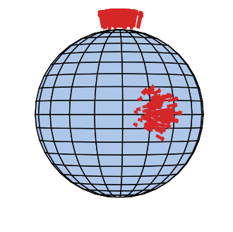
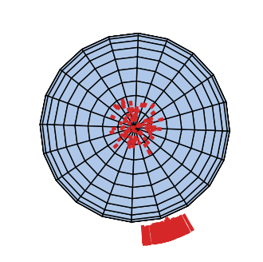
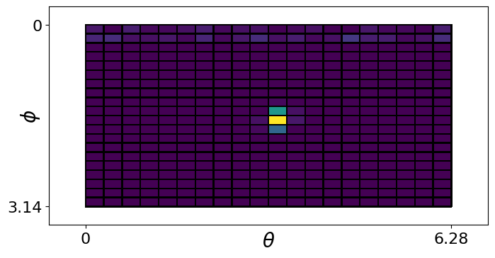
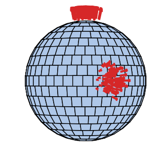
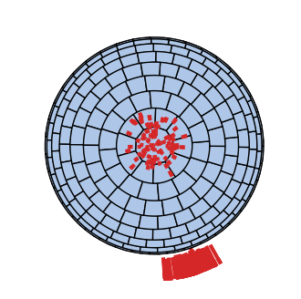
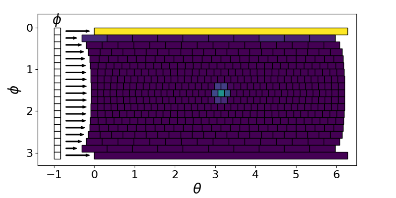

# Visualize Sphere Decompositions

Visualize Sphere decompositions. 

## UV Sphere

Cells are partitioned into equal steps in polar coordinates. Data is laid out in a flat 2D array.

UV Sphere Equator             |  UV Sphere Pole
:-------------------------:|:-------------------------:
  |  

Here is the histogram of the cells in polar coordinates. Notice that the plane near the pole is not detected.

## Ball Sphere

The elevation (phi) polar coordinate is split into equal blocks. However the azimuth data is split into a different number of cells. This leads to more uniform cell area. However the shape of each cell is different. A cap is placed at the pole.  Data is a list lof lists.

Ball Sphere Equator             |  Ball Sphere Pole
:-------------------------:|:-------------------------:
  |  

Here is the histogram of the cells in polar coordinates. Notice that the plane near the pole is detected. However the resolution of the azimuth angle is significantly less than at the equator. This lead to a much higher degree of uncertainty in the peak. Additionally peak detection is no equivariant because the cells have different shapes and areas.

